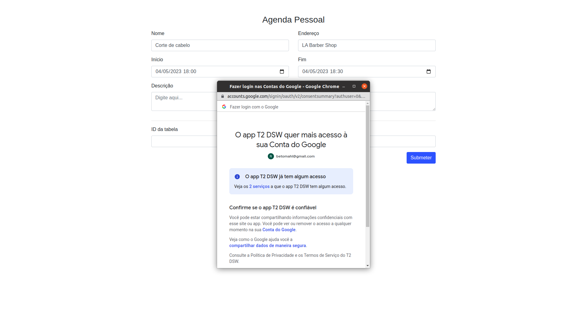
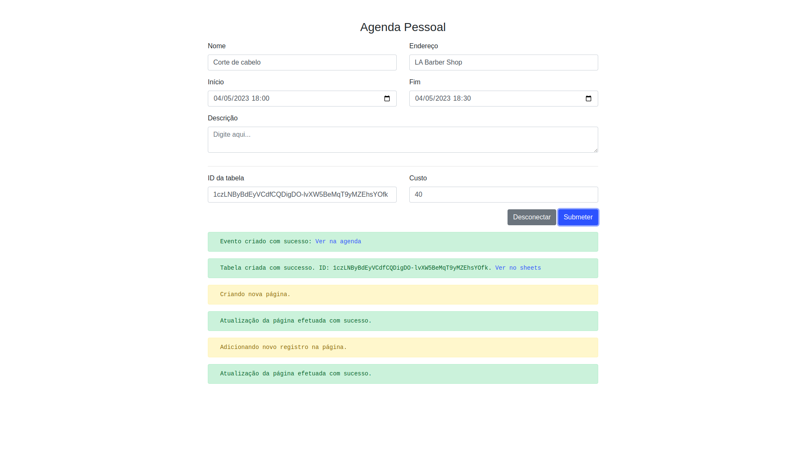

# Criador de eventos do Google Agenda com registro de gastos no Google Sheets

Acesso: [https://elc1090.github.io/project2-robertomahl/](https://elc1090.github.io/project2-robertomahl/)

#### Desenvolvedor(a)
Roberto José Mahl - roberto.mahl@acad.ufsm.br

#### Parcerias
Luana Ferreira Oliveira - luana.oliveira@acad.ufsm.br

Gilson Garcia da Silva Júnior - gilson.silva@acad.ufsm.br

#### Tecnologias
- HTML
- CSS
- Javascript
- Bootstrap

#### Ambiente de desenvolvimento
- VS Code
- Google Chrome
- Github

#### Créditos
- [Google API](https://developers.google.com)
- [Bootstrap](https://getbootstrap.com/)

#### Bastidores
Optei por utilizar as APIs do Google porque utilizo os serviços da empresa ostensivamente no meu dia-a-dia. Além disso, minha proposta busca tratar uma necessidade minha, integrar monitoramento de gastos e controle de agendamentos de maneira simples e rápida - afinal, são processos que podem ser feitos manualmente, e a vantagem de tê-los integrados é economizar tempo. Ademais, acredito que ter conhecimento sobre o uso das APIs do Google pode vir a ser útil no futuro, o que foi outro grande fator de escolha.

Para este projeto, optei por permanecer usando uma stack mais simples de tecnologias, uma vez que gastaria muito tempo estudando a documentação das duas APIs que utilizei - Google Calendar e Google Sheets. Sendo assim, utilizei os tradicionais HTML, CSS (através do Bootstrap) e Javascript e tomei como base a estrutura do projeto 2a. Em algum ponto do desenvolvimento cheguei a questionar essa decisão, mas, ao final, percebo que aprendi bastante sobre Javascript, principalmente se tratando de requisições síncronas e assíncronas e seus respectivos tratamentos.

Logo ao iniciar o projeto, assim que obtive algum contexto a partir da documentação oficial, parti para o console Cloud do Google para registrar meu projeto e criar a chaves de API e o ID de cliente. O processo não é tão trivial, mas está relativamente bem explicado. Então, consegui me virar. Feito isso, gastei algum tempo tentando ocultar as chaves então criadas no código fonte, até perceber que poderia apenas restringir as suas possibilidades de uso a partir das suas próprias configurações. 

Os primeiros passos de desenvolvimento foram com a API do Calendar, e se basearam nos demos presentes na documentação oficial. Obter os primeiros resultados foi recompensador e me fez querer ir adiante. Logo, estava com a primeira metade pronta. 

Lidar com a API do Google Sheets foi um pouco mais complicado, entretanto. Ela envolve maior número de requisições, que possuem corpos maiores e mais complexos. Um dos maiores tropeços durante o desenvolvimento, por exemplo, foi acreditar que poderia buscar a planilha de gastos a ser editada pelo seu nome, o que não foi possível e resultou em uma reviravolta na funcionalidade. Descobri, então, que para editar uma planilha, precisava necessariamente do seu ID (spreadsheetId), que é único a cada planilha e não poderia ser definido por mim na hora da criação. Como não planejava utilizar banco de dados ou alguma outra solução para armazenar os diferentes IDs dos diferentes usuários, cheguei à seguinte solução: a adição de um novo campo de texto na tela, que seria preenchido com o spreadsheetId a partir de um cookie previamente salvo. Assim, pude evitar o uso de banco de dados sem prejudicar a experiência do usuário tão gravemente. A solução possui ressalvas, já que o cookie possui data de expiração e pode ser apagado, ou, então, o uso pode ser feito a partir de diferentes dispositivos. De todo modo, o ID ainda pode ser copiado e salvo em alguma outra forma pelo usuário, caso desejado.

Em adição, nunca havia utilizado cookies e mal conhecia seu funcionamento, que vejo agora ser muito básico. Descobri, entretanto, que seriam necessárias algumas adequações à LGPD para que meu uso deles estivesse mais correto (e legal).

A publicação do aplicativo no Google Cloud foi, enfim, feita. Atualmente, ele possui limite de 100 contas por não estar verificado pelo Google. Para que isso ocorresse, eu precisaria de:
1. Um link oficial para a Política de Privacidade do seu aplicativo;
2. Um vídeo do YouTube mostrando como você planeja usar os dados do usuário do Google que obtiver dos escopos;
3. Uma explicação por escrito ao Google sobre por que você precisa acessar dados do usuário restritos e/ou confidenciais;
4. Todos os seus domínios verificados no Google Search Console.

Assim, optei por manter o aviso de inseguro e o limite de 100 contas, que espero que não seja ultrapassado até minha apresentação.

---
Projeto entregue para a disciplina de [Desenvolvimento de Software para a Web](http://github.com/andreainfufsm/elc1090-2023a) em 2023a
